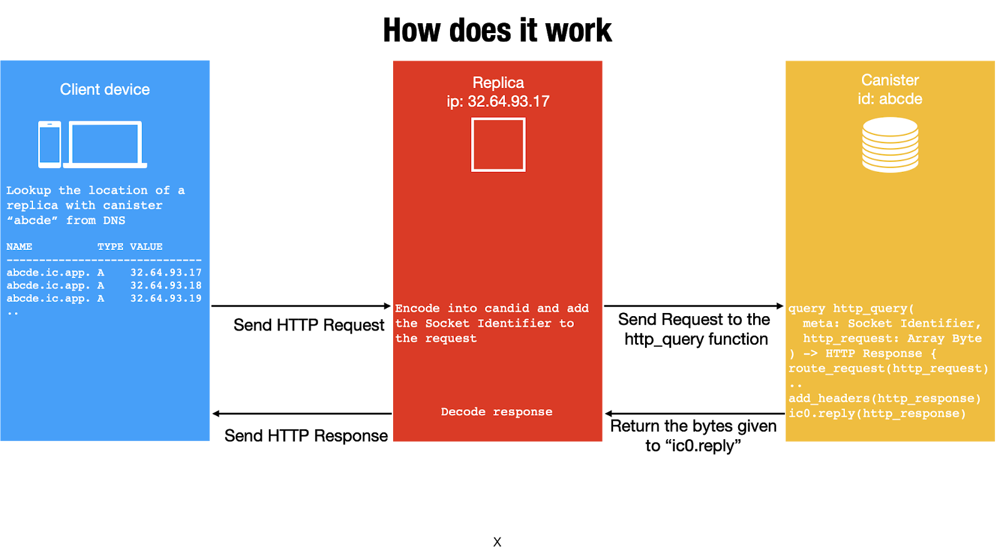

# Module 1: Intro to Web Development on the IC

## Outline

1. [Developer Experience in the Legacy IT Stack](#Developer-Experience-in-the-Legacy-IT-Stack)
2. [Developing on the IC](#Developing-on-the-IC)
   1. [Canister Messaging](#Canister-Messaging)
   2. [HTTP Requests](#HTTP-Requests)
   3. [Cycles](#Cycles)
   4. [Autonomous Canisters](#Autonomous-Canisters)
3. [Developer Resources](#Developer-Resources)

## Developer Experience in the Legacy IT Stack

[TODO - MOVE TO IC APPLICATION MONTH]

*The many pain-points of developing a web application on a service like Ethereum.* 

## Developing on the IC

The IC vastly simplifies the process of writing and deploying web applications for developers. Namely, software canisters abstract away many of the complex parts of web development - after writing code, developers can directly deploy their applications to the IC platform without having to worry about how it's hosted, platform security, or overly complex database management. Canisters recreate the traditional three-tier software architecture that includes the presentation layer/UI, the business logic layer, and the data access or persistence layer. [This Medium post](https://medium.com/dfinity/how-software-developers-build-better-on-the-internet-computer-1360d162a93c) delves a bit deeper into the main value propositions of developing applications on the IC. 

In writing web applications on the IC, developers need not maintain complex backends or worry about using a Big-Tech server provider like AWS or Azure. Check out [this Medium post](https://medium.com/dfinity/how-i-built-a-multiplayer-reversi-game-on-the-internet-computer-f67d2fed0fc3) by Paul Liu, a Staff Engineer at DFINITY, to see how he created an online, multiplayer game on the IC. Paul provides a great description of web development on the IC:

> The experience of developing a web application on the Internet Computer is close to that of (the now defunct) [Parse](https://en.wikipedia.org/wiki/Parse_(platform)) or [newer](https://en.wikipedia.org/wiki/Platform_as_a_service) [platforms](https://en.wikipedia.org/wiki/Function_as_a_service) of [a similar vein](https://en.wikipedia.org/wiki/Serverless_computing). The basic premise of such a platform is to hide the complexity of building and maintaining backend services such as HTTP servers, databases, user logins, and so on. Instead, they present an abstract virtual environment that just runs user applications, without users being aware of, or having to pay attention to, where and how their applications are run.

### Canister Messaging

Canister messaging serves as the backbone for inter-canister communication, allowing canisters to query each other for information and update state. There are two types of inter-canisters messages on the IC: **query** calls and **update** calls. Query calls are designed with speed in mind: they run in roughly 10 milliseconds, and they don't change the state of the queried canister. Update calls change the state of a canister - they must go though consensus, so they, on average, take around 2 seconds to execute. 

#### Query Calls

Query calls allow the user to query the current state of a canister or call a function that operates on the canister’s state **without changing it**.

- Are synchronous and answered immediately.
- Can be made to any node that holds the canister and do not require consensus to verify the result. There is an inherent tradeoff between security and performance because the reply from a single node might be untrustworthy or inaccurate.
- Do not allow changes to the state of the canister to be persisted. Essentially, programs use query calls to perform read-only operations.
- Do not allow the called canister to invoke functions exposed by other canisters as inter-canister calls. (Note that this restriction is temporary and that canisters will be able to invoke functions exposed by other canisters when processing query calls in the future.)

#### Update Calls

Update calls allow the user to change the state of the canister and have **changes persisted**.

- Are answered asynchronously.
- Must pass through consensus to return the result. Because consensus is required, changing the state of a canister can take time. Therefore, update calls use the actor-based programming model (with state isolation) to allow concurrent and asynchronous processing. There is an inherent tradeoff between security and performance because two-thirds of the replicas in a subnet must agree on the result.
- The called canister can invoke functions exposed by other canisters

### HTTP Requests

Let's dive under the hood to get a better sense of how HTTP requests work on the IC. First, a client device queries a website, which using DNS is resolved into a list of IP addresses of the replica nodes in closest proximity that store the desired canister. The full HTTP request is passed to the replica, which performs a query call to the canister. Finally, the canister passes the HTTP response back to the replica, which is sent to the end user's device and decoded to display the relevant website info. 

All developers need to do is structure how their canisters should handle various HTTP requests, which we touch upon in the subsequent three modules. 

### Cycles

In general, all canisters consume resources in the form of CPU cycles for execution, bandwidth for routing messages, and memory for persisted data. Canisters maintain an account balance to pay for the cost of communication, computation, and storage their applications consume. The cost of computation is referred to as **cycles**.

Cycles reflects the real costs of operations including resources such physical hardware, rack space, energy,storage devices, and bandwidth. In simple terms, a **unit of cycles** represents the cost of executing a single WebAssembly instruction.

- Programs must be able to pay for complete execution (all or nothing), but the cost associated with a unit of cycles will make efficient programs cost-effective.
- By setting limits on how many cycles a canister can consume, the platform can prevent malicious code from draining resources

The relative stability of operational costs makes it easier to predict the cycles required to process, for example, a million messages.

As a developer it is important to understand that you need not "count cycles" when programming in the same way that you wouldn't measure the electricity required to run a program. Organizations that deploy canisters are expected to charge those canisters with a small amount of cycles and top them up on a regular basis, allowing one to understand the cost of a program on a longer timescale. 

### Autonomous Canisters

Autonomous canisters are canisters that run without a particular owner. Once they are deployed, voting power can be assigned to other participating canisters, allowing for use of a democratic process to control and upgrade the main canister. 

This sounds a bit abstract, so let's take a look at a specific example our how this might operate if we were creating an open auction-based selling platform. Let's say we want the community and relevant stakeholders to be involved in the decision-making process for upgrading our platform canister(s). We have two options to do so:

1. We could create a forum in which members could discuss and propose various changes to the service. However, in this example, the original owner of the canister would still retain full control. At the end of the day, they have complete authority to implement or not implemented suggested upgrades, even if those upgrades aren't what other stakeholders desire. Such a setup doesn't guarantee rights to participants/stakeholders and therefore isn't truly "open."
2. In contrast, we could deploy an autonomous governance canister to manage the upgrades of the auction canister(s). This governance canister would act as a method of polling users, allowing them to vote on various upgrade proposals. This canister is the one that would then implement the migration of the auction canister(s).

As seen in these two examples, autonomous canisters have the power to guarantee rights to stakeholders in applications that truly want to be "open."

Here's a more in-depth overview of autonomous canisters, from the [DFINITY FAQ](https://dfinity.org/faq/how-can-the-internet-computer-undo-the-monopolization-of-the-internet):

> But how will one of these new open internet services be created? For example, let’s imagine some entrepreneur wishes to create a replacement for LinkedIn on the Internet Computer. The first step they would probably take, is to create a basic prototype, since LinkedIn is no marvel of engineering, and then upload the software “canisters” involved to the Internet Computer. At this point, the entrepreneur retains control over the service because they have a cryptographic key that allows them to configure and upgrade its systems. However, they would then upload an autonomous tokenized governance canister, and then irrevocably transfer control of the new service to this (so that it becomes part of that autonomous system). Of course, at this stage they would hold all the governance tokens, but their aim would be to divest themselves of tokens over time to fund development and incentivize contributors, such that eventually they hold only a minority stake and the service becomes truly “open”.
>
> We think that the larger the number of holders of voting tokens in the governance systems of internet services, the more attractive the internet service will be and the greater the number of supporters and promoters they shall have. Founders and key participants will still drive key decisions and day-to-day operations as most governance canisters, such as the standard ones offered by DFINITY, will support variations on “liquid democracy” algorithms that allow token holders to assign their voting power to others (where after the assignments of voting power will generally mostly be updated only when systemic problems emerge or emergencies occur) providing for strong dynamic leadership even though there may be enormous numbers of stakeholders. However, even if the founders of an internet service fail to divest themselves of sufficient governance tokens to make it truly open, their project can still guarantee that APIs they publicly share will not be revoked.

## Developer Resources

Below are some DX resources provided by the [Developer Experience](https://medium.com/dfinity/developer-experience-dx-and-the-internet-computer-1700c13fab9e) Medium Post.

The Internet Computer’s DX is always growing and expanding, but it’s currently segmented into the following key areas:

## **Tools**

- [*DFINITY Canister SDK*](https://sdk.dfinity.org/docs/download.html?utm_source=medium&utm_campaign=dx): A software development kit that developers can use to create applications for the Internet Computer.
- [*Rust CDK*](https://github.com/dfinity/cdk-rs): A canister development kit that developers can use to program software for the Internet Computer in Rust.
- [*Vessel Package Manager*](https://github.com/kritzcreek/vessel): A simple package manager for the Motoko programming language.
- [*Motoko VS Code Extension*](https://marketplace.visualstudio.com/items?itemName=dfinity-foundation.vscode-motoko): Syntax highlighting for the Motoko programming language in VS Code.

## **Languages**

- [*Motoko*](https://www.youtube.com/watch?time_continue=3&v=WUqMwqt7abQ&feature=emb_logo): A programming language specifically designed to support the unique features of the Internet Computer and to provide a familiar yet robust programming environment.
- [*Candid*](https://github.com/dfinity/candid): An interface description language (IDL) that’s used to visualize data exchange between software canisters on the Internet Computer.
- [*WebAssembly*](https://developer.mozilla.org/en-US/docs/WebAssembly/Concepts): A way to run code in multiple languages on the web at lightning-fast speeds.

## **Guidance**

- [*Developer Forum*](https://forum.dfinity.org/?utm_source=medium&utm_campaign=dx): A friendly discussion board where developers can ask questions and explore topics of interest.
- [*Documentation*](https://sdk.dfinity.org/docs/index.html?utm_source=medium&utm_campaign=dx): The SDK microsite contains a wealth of documentation, [videos and tutorials](https://sdk.dfinity.org/docs/videos-tutorials.html?utm_source=medium&utm_campaign=dx), and examples for developers to start building their first app.
- [*Hackin’ on the Internet Computer*](https://www.youtube.com/watch?v=Ufh_1rHkg_E&list=PLuhDt1vhGcrddBFeoXw41XFFjmsERO09O&ab_channel=DFINITY): SDK Engineer Hans Larsen hosts this video series about building various projects on the platform.
- *Support*: Bugs and feature requests can be filed by emailing support@dfinity.org.

## **Sample Apps**

- [*Sample App Repo*](https://github.com/dfinity/examples/tree/master/motoko): Simple example apps in Motoko.
- [*LinkedUp*](https://github.com/dfinity-lab/linkedup): A professional social network built upon the Internet Computer that was demonstrated at the 2020 World Economic Forum in Davos.
- *CanCan*: A decentralized, scalable video-sharing mobile app that was unveiled at [the launch](https://medium.com/dfinity/the-internet-computer-welcomes-third-party-developers-to-tungsten-6984565ec8f4) of the [Tungsten Developer Network](https://dfinity.org/tungsten?utm_source=medium&utm_campaign=dx).
- [*Reversi*](https://ninegua.github.io/reversi/): DFINITY Staff Engineer Paul Liu [built a multiplayer Reversi game](https://medium.com/dfinity/how-i-built-a-multiplayer-reversi-game-on-the-internet-computer-f67d2fed0fc3) (also called Othello) on the Internet Computer.
- [*Superheroes*](https://github.com/enzoh/superheroes): DFINITY Senior Engineer Enzo Haussecker demonstrated how to build a CRUD application on the Internet Computer using Motoko and React.
- [*IC Game Terminal*](https://github.com/matthewhammer/ic-game-terminal): DFINITY Engineer & Researcher Matthew Hammer created a game terminal with simple keyboard input and graphical output.