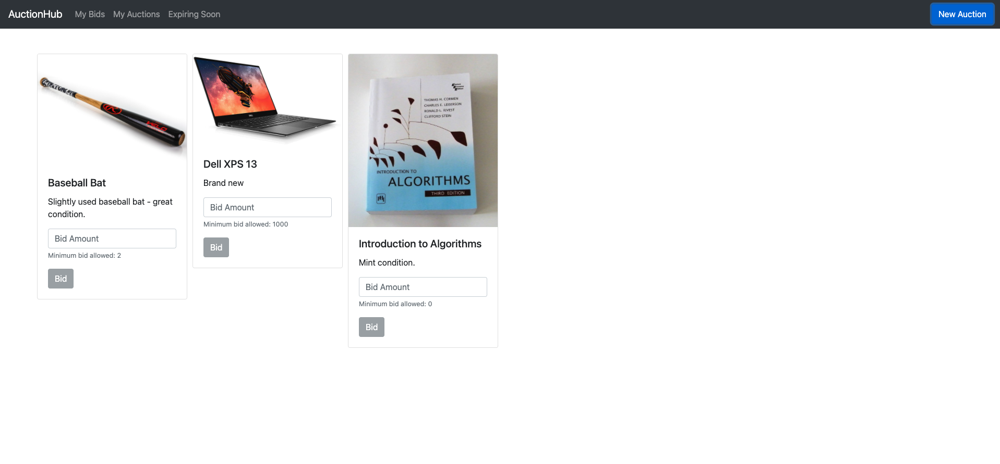

# Module 3: Connecting to the Frontend

Now that you've completed the basic implementation of our open auction platform, it's time to link it to a frontend view! This module will guide you through the preliminary steps required to create and customize a frontend for your IC applications. 
<p align="center"> </p>


## Background

This module assumes basic proficiency with HTML, CSS, JavaScript, and React. We use the React framework to simplify the process of building our user interface. If you aren't familiar with React, [read through this tutorial](https://reactjs.org/tutorial/tutorial.html) created by the developers to get comfortable with using the framework - it only requires knowledge of HTML and JavaScript. 

Additionally, we have configured the starter files to work with React, but it's important to understand that you normally would have to complete this process yourself. Here is a [DFINITY SDK tutorial](https://sdk.dfinity.org/docs/developers-guide/tutorials/custom-frontend.html) that walks through the basics of setting up a frontend view for the IC, which you may find useful to skim before starting this module.

## Your Task

We have provided starter code that sets up the React framework and configures it for use with our `web_development` canister. Your job is to complete the implementation of several JavaScript methods tasked with querying and updating our backend canister. 

### Code Understanding

Now let's take a look at our frontend assets, which are all stored in the `frontend` directory. Notice that we exclusively use `.jsx` files here, which are a variation of `.js` files that extend React functionality. You can read more about this file type and its properties on the [React page](https://reactjs.org/docs/introducing-jsx.html).

#### `index.jsx` & `app.jsx` 

In `index.jsx` we use the standard React `render` function to render the `App` component, which we've defined in `App.jsx`, to display our whole frontend. `App.jsx` is where the real magic happens, so let's turn to that file for a quick look-through. In `App.jsx`, the first two lines import relevant React functions and libraries that we will use in our code. The next line imports our `web_development` canister, which we previously implemented in Module 2. Finally, we import two React components that we've defined in separate files, `Grid` and `AuctionNavbar`, which together form most of the HTML that we display on our webpage.

The first function you'll notice in `App.jsx`, `getAuctions()`, is one that you will implement to retrieve the list of auctions from out `web_development` canister. Next, we define our `App` component, which is defined as an anonymous function (as is standard in React) with the syntax `() => {function body}`.

We take advantage of [React's `useState()` hook](https://reactjs.org/docs/hooks-reference.html#usestate) to create a new `itemList` that stores our list of auctioned items and a corresponding `setItemList` function that allows us to modify this list. Next, we use [React's `useEffect()` hook](https://reactjs.org/docs/hooks-reference.html#useeffect) to call the `setup` function in our `web_development` canister (located in `Main.mo`), which instantiates the `Balances`, `App`, and `Governor` canisters and initializes them with starting values, as well as retrieve the auctions and store them in our `itemList`. Side effects - modifications of state that don't return a value - aren't allowed in React, which exists in a "purely functional world," so we must call `useEffect` to run these functions and update the state (current auctions) of our app. Finally, we return the HTML that we want to be rendered, which consists of our `AuctionNavbar`, a small divider (to create a small margin below the bar), and our `Grid` of items.

#### `Item.jsx`

The `Item` component takes in a `name`, `description`, and `imageURL` and creates a [Bootstrap Card](https://getbootstrap.com/docs/4.0/components/card/) to display the item in a nice little box on our page. The specifics regarding how this component is constructed aren't particularly important - at a high level, we just check that the bid is valid (an integer, greater than the current bid, etc.) and then instruct React how to format the card based on the inputted `Item` data.

`Item.jsx` also contains the function `bidOnAuction()`, which you will ultimately implement, that updates our `App` canister with new bids once a bid is submitted on the frontend. 

#### `AuctionNavbar.jsx`

The `AuctionNavbar` component takes in a `props` parameter and creates a [Bootstrap Navbar](https://getbootstrap.com/docs/4.0/components/navbar/) to enable easy page navigation. When we call `AuctionNavbar` in `App.jsx` and set `setter={setItemList}`, we are essentially passing the `setItemList` to our `AuctionNavbar` component, which we can access with `prop.setter` in `AuctionNavbar.jsx`. We use this function to modify our `itemList`, which we defined in `App.jsx`, when we create a new auction. 

You'll notice that this Navbar includes a button on the far-right used to create a new auction. When this button is clicked, we display a `NewAuctionModal` component (which we will discuss next).

#### `NewAuctionModal.jsx`

The `NewAuctionModal` component takes in three parameters, `show`, `onHide`, and `addToAuctions`, and creates a [Bootstrap Modal](https://getbootstrap.com/docs/4.0/components/modal/), a pop-up box that allows users to create a new auction. The important parameter here is `addToAuctions`, which stores the function `setItemList` that allows us to modify the `itemList` when a user enters a new auction.

We also have the function `addAuction`, left for you to implement, which updates our `App` canister to store a new auction once a user enters its info on the frontend.

#### `Grid.jsx`

The `Grid` component, similar to `AuctionNavbar`, accepts a `props` parameter that we can use to access relevant characteristics of the `itemList` and then creates an [infinite grid](https://www.npmjs.com/package/@egjs/react-infinitegrid) to display our auction cards. Again, the specific implementation isn't particularly relevant, but notice how we access the `name`, `description`, and `imageUrl` fields for each item in our `itemList` to create its corresponding card. 

### Specification

**Task:** Complete the implementation of `getAuctions()` in `App.jsx`,  `bidOnAuction()` in `Item.jsx`, `addAuction` in `NewAuctionModal.jsx`.

**`getAuctions`** retrieves auctions from the `App` canister to display them in the frontend

**`bidOnAuction`** takes bids from the frontend and updates the corresponding auctions in the `App` canister with them

**`addAuction`** takes the auctions created in the frontend and updates our `App` canister with them

#### Front-End Testing

To access the front-end of your application, open a browser and paste:

```
http://127.0.0.1:8000/?canisterId=CANISTER_ID
```

Replacing `CANISTER_ID` with the identifier of your `web_development_assets` canister. The identifier should take the general form of `cxeji-wacaa-aaaaa-aaaaa-aaaaa-aaaaa-aaaaa-q`.

From here, you should see a view similar to that displayed in the picture at the top of this document. Try to create a new auction by clicking the "New Auction" button on the top right, and then explore some of the other front-end features. Once you create a new auction, refresh the page to see that the item persists. Finally, try performing some command-line tests (as described at the bottom of the Module 2 document) to see if the auctions you added were successfully stored in the `web_development` canister backend. 

